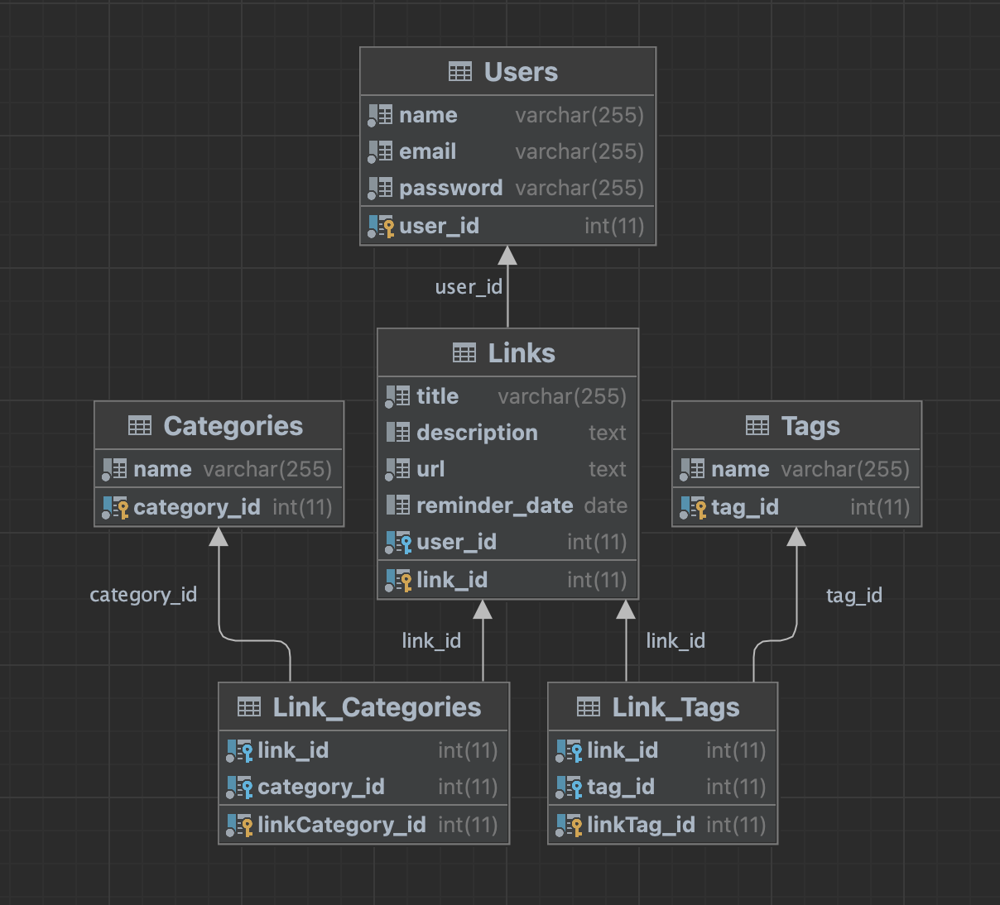

# LinkPilot

The goal of LinkPilots is to develop a web application that makes it simple for users to collect, organize, and distribute their links.
<br>
Users frequently run into problems like forgetting to bookmark important websites or having trouble finding previously saved URLs.
<br>
Our main goal is to provide a user-friendly design that makes it easier to gather and organize connections, especially those that are pertinent to users' studies.
<br>
We also hope to offer a management tool that helps users properly cite their sources.


## Stack Technology

| Frontend | Backend | Database |
|----------|:-------:|:---------:|
|  |  |  |
| |  | |

## Functions
- Create / Read / Update / Delete user's link list

## Database schema


## To run the frontend and backend in developing mode
cd to backend then run.
```
    npm i
```
```
    npm run dev
```
cd to frontend then run
```
    npm i --force
```
```
    npm run dev
```

## API endpoints
